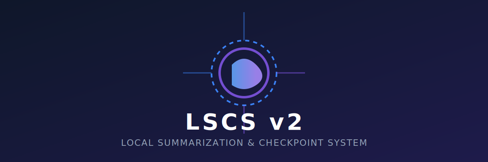
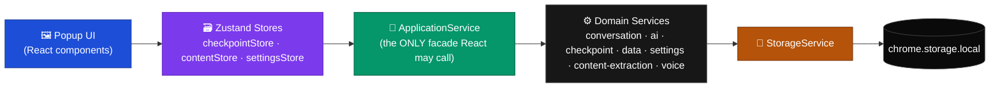
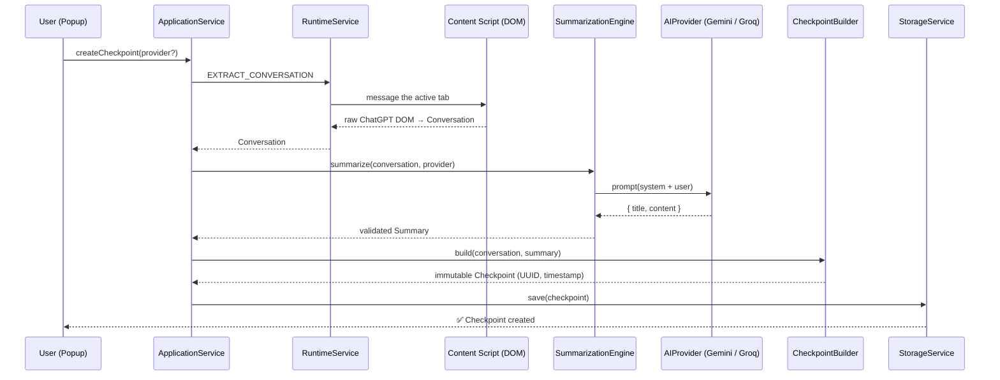
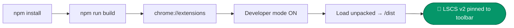

<div align="center">



### 🧠 Local Summarization &amp; Checkpoint System — a Chrome extension that reads, remembers, and talks back.

<p>
  
  
  
</p>

<p>
  
  
  
  
  
  
</p>

**[Overview](#-overview) · [Demo](#-live-in-the-popup) · [Features](#-feature-matrix) · [Architecture](#-architecture) · [Install](#-getting-started) · [Dev Guide](#-development) · [Roadmap](#-roadmap)**

</div>

<br/>

> [!NOTE]
> This repository (`hexslayerz`) ships the **LSCS v2** Chrome Extension — a from-scratch rewrite that replaces a loose script with a strict, layered, Domain-Driven-Design codebase. Nothing here talks directly to `chrome.*` except two files. Everything else is pure, typed, testable domain logic.

<br/>

## 📖 Overview

**LSCS v2** sits quietly in your Chrome toolbar and does three jobs extremely well:

1. **It watches your ChatGPT conversations** and, on demand, extracts them straight out of the DOM — no copy-pasting, no screenshots.
2. **It hands that conversation to an AI provider** (Google Gemini or Groq's `llama-3.3-70b-versatile`, today) and gets back a structured, validated summary.
3. **It seals the result into an immutable *Checkpoint*** — a timestamped, searchable, exportable snapshot you can recall weeks later without re-reading a 400-message thread.

But conversation checkpointing is only half the extension. LSCS v2 also ships a **general-purpose page reader**: point it at *any* webpage or local PDF, and it will extract clean structured content, classify the site (Wikipedia / GitHub / docs / blog / generic), let you **chat with the page** via an AI Q&A engine, and **read it aloud** with a full text-to-speech pipeline — including hands-free, voice-command-driven navigation ("read this page", "summarize this page", "pause", "repeat"...).

<div align="center">
<sub>Popup UI mockups below are generated directly from this repo's real Tailwind design tokens and component layout — see <a href="#-live-in-the-popup">Live in the Popup</a>.</sub>
</div>

<br/>

## 🎬 Live in the Popup

<div align="center">

<br/>
<sub>Checkpoint Manager → Content Extractor → Settings, cycling automatically</sub>
</div>

<br/>

<div align="center">

</div>

<table>
<tr>
<td width="33%" valign="top">

**🗂 Checkpoint Manager**
Search, filter by provider, sort by date. Every card shows the AI title, a two-line summary preview, the message count, and one-click access to the original thread or raw JSON.

</td>
<td width="33%" valign="top">

**🌐 Content Extractor**
Extracts *any* page (or PDF) into clean sections, auto-classifies the site type, and opens an AI chat scoped strictly to that page's content — with a mic button for voice questions.

</td>
<td width="33%" valign="top">

**⚙️ Settings**
Provider selection, theme, summary length, confirmation dialogs, full voice tuning (rate/pitch/volume/voice picker), hands-free mode, API keys, and JSON export/import/backup/restore.

</td>
</tr>
</table>

<br/>

## ✨ Feature Matrix

| Domain | Capability | Status |
|---|---|:---:|
| **Conversation** | Detects & extracts ChatGPT conversation DOM into a normalized `Conversation` object | ✅ |
| **AI Summarization** | Provider-agnostic prompt → `AIProvider` → validated `Summary` pipeline | ✅ |
| | Google **Gemini** (`gemini-1.5-pro`) live provider | ✅ |
| | **Groq** (`llama-3.3-70b-versatile`) live provider | ✅ |
| | OpenAI / OpenRouter / Local providers | 🧪 stubbed, pluggable |
| **Checkpoints** | Immutable snapshot builder with UUID + schema versioning | ✅ |
| | Local search, provider filtering, chronological sort | ✅ |
| | One-click copy-as-JSON / jump to original thread | ✅ |
| **Content Extraction** | Generic webpage → cleaned, sectioned, noise-filtered content | ✅ |
| | Website classifier (Wikipedia / GitHub / Docs / Blog / Generic) | ✅ |
| | **PDF text extraction** via `pdf.js`, page-by-page, with metadata title | ✅ |
| | **Q&A Engine** — ask questions grounded strictly in extracted page content | ✅ |
| **Voice & Accessibility** | Text-to-speech reader with rate / pitch / volume / voice selection | ✅ |
| | Section-by-section page reading with resumable progress | ✅ |
| | Voice command parser (`read this page`, `pause`, `resume`, `repeat`, …) | ✅ |
| | Hands-free continuous voice conversation mode | ✅ |
| **Data Management** | JSON export / import with schema validation | ✅ |
| | Local backup & restore | ✅ |
| | Versioned migration service | ✅ |
| **Engineering** | Manifest V3, zero business logic in React, strict TypeScript, ESLint + Prettier CI gates | ✅ |

<br/>

## 🏗 Architecture

LSCS v2 enforces an intentionally rigid, **strictly unidirectional** architecture. React components render state and dispatch intents — nothing more. Every side effect, validation, and transformation lives in a single-responsibility service.



> **Never bypass `ApplicationService`.** React must never touch a domain service — let alone `chrome.*` — directly. Only `StorageService` and `RuntimeService` are permitted to call Chrome APIs at all.

### The Checkpoint pipeline, end to end



### Six subsystems, one contract

```mermaid
flowchart TB
    subgraph Conversation
        A1[Detect] --> A2[Extract] --> A3[Clean] --> A4[Serialize]
    end
    subgraph AI
        B1[Prompt] --> B2[Provider] --> B3[Engine] --> B4[Validate]
    end
    subgraph Checkpoint
        C1[Model] --> C2[Build] --> C3[Validate] --> C4[Store]
    end
    subgraph Recall
        D1[Retrieve] --> D2[Filter] --> D3[Sort] --> D4[Search]
    end
    subgraph Settings
        E1[Model] --> E2[Defaults] --> E3[Validate] --> E4[Store] --> E5[Service]
    end
    subgraph "Data Management"
        F1[Model] --> F2[Validate] --> F3[Migrate] --> F4["Import/Export"] --> F5["Backup/Restore"]
    end
```



### SOLID, applied literally

| Principle | Where it lives in this codebase |
|---|---|
| **S** — Single Responsibility | `SettingsValidator` only validates settings. `ContentCleaner` only cleans. Every file, one job. |
| **O** — Open/Closed | `AIProviderType` + `ProviderFactory` let you register a brand-new AI provider without touching `SummarizationEngine`. |
| **L** — Liskov Substitution | Every provider implements the same `AIProvider` interface — Gemini, Groq, or a future OpenAI provider are interchangeable. |
| **I / D** — Interface Segregation & Dependency Inversion | `ApplicationService` abstracts storage/runtime away from React entirely; components depend on a facade, never a concretion. |

<br/>

## 📁 Project Structure

```text
src/
├── background/                 # Chrome service worker & message router
│   ├── handlers/                #   one handler per RuntimeMessageType
│   └── router.ts                #   dispatch table (type → handler)
├── content/                    # Injected content script (DOM access on <all_urls>)
├── popup/                      # Extension popup entry (App.tsx, main.tsx)
├── components/                 # Presentational React components — zero business logic
├── hooks/                      # useVoiceChat, usePageReader, useSpeechRecognition, …
├── stores/                     # Zustand: checkpointStore · contentStore · settingsStore
├── services/                   # 🧠 THE DOMAIN LAYER
│   ├── application/              #   ApplicationService — the only facade the UI may call
│   ├── conversation/              #   Detect → Extract → Clean → Serialize (ChatGPT)
│   ├── content-extraction/        #   Generic page/PDF extraction, classification, Q&A
│   ├── ai/                        #   Prompt building, provider factory, validation
│   │   └── providers/                #   GeminiProvider · GroqProvider · StubProvider
│   ├── checkpoint/                #   Build, validate, store, search, filter, recall
│   ├── settings/                  #   Typed settings model + validated persistence
│   ├── data/                      #   Export / Import / Backup / Restore / Migration
│   ├── voice/                     #   SpeechSynthesisService, VoiceCommandParser
│   ├── chrome/                    #   The ONLY layer allowed to call chrome.* directly
│   └── runtime/                   #   Typed message contracts between popup ⇄ background ⇄ content
├── constants/ · types/ · utils/  # Shared, app-wide primitives
└── assets/
```

<sub>Full reference: <a href="docs/FOLDER_STRUCTURE.md">docs/FOLDER_STRUCTURE.md</a></sub>

<br/>

## 🧬 Tech Stack

<div align="center">

| Layer | Choice | Why |
|---|---|---|
| UI | **React 19** + **TailwindCSS 4** | Function components, zero CSS build config via `@tailwindcss/vite` |
| State | **Zustand 5** | Minimal, unopinionated, no boilerplate — perfect for a 400×600px popup |
| Build | **Vite 8** (dual config: popup + content script) | Instant HMR in dev, separate bundling for MV3's isolated worlds |
| Language | **TypeScript ~6.0**, strict mode, no `any` | Every payload from `chrome.storage` is runtime-validated, not just typed |
| Extension | **Manifest V3**, service-worker background | Future-proof against MV2 deprecation |
| AI | **Gemini 1.5 Pro** · **Groq Llama 3.3 70B** | Structured JSON responses, provider-swappable via `ProviderFactory` |
| Documents | **pdf.js** | Client-side, page-by-page PDF text extraction — no server round trip |
| Icons | **lucide-react** | Consistent, tree-shakeable icon set |
| Quality | **ESLint 10** + **typescript-eslint 8** + **Prettier 3** | Zero-warning CI gate before merge |

</div>

<br/>

## 🚀 Getting Started

```bash
# 1. Clone
git clone https://github.com/DhruvOzha85/hexslayerz.git
cd hexslayerz

# 2. Install dependencies
npm install

# 3. Build the production bundle
npm run build

# 4. Load into Chrome
#    chrome://extensions → enable "Developer mode" → "Load unpacked" → select /dist
```

<div align="center">



</div>

Once loaded, open any ChatGPT conversation and click **Extract Checkpoint** — or navigate to any article, doc site, or PDF and click **Extract Page Content** to start chatting with it.

<br/>

## 🛠 Development

| Command | Purpose |
|---|---|
| `npm run dev` | Vite dev server with fast HMR for the popup |
| `npm run build` | Type-checks, then builds the popup **and** the content script bundle |
| `npm run preview` | Preview a production build locally |
| `npm run lint` / `lint:fix` | ESLint across the entire codebase |
| `npm run format` / `format:check` | Prettier formatting |
| `npm run typecheck` | `tsc -b` in `--noEmit` mode — the CI type gate |

### The four house rules

> Read the full guide: [`docs/DEVELOPER_GUIDE.md`](docs/DEVELOPER_GUIDE.md)

1. **No business logic in `.tsx` files.** No `.map()` filtering, no validation — route it through a domain service, exposed via `ApplicationService`.
2. **No unsafe Chrome API calls.** Only `StorageService` and `RuntimeService` may touch `chrome.*`.
3. **Validate everything from disk.** `chrome.storage` can be corrupted or tampered with — `SettingsValidator` / `CheckpointValidator` / `DataValidator` gate every read.
4. **No `any`.** `unknown` is allowed at runtime-validation entry points; that's it.

### Adding a new subsystem (e.g. `Analytics`)

```mermaid
flowchart LR
    S1["1. src/services/analytics/"] --> S2["2. AnalyticsTypes.ts"]
    S2 --> S3["3. AnalyticsValidator.ts"]
    S3 --> S4["4. AnalyticsStorage.ts"]
    S4 --> S5["5. AnalyticsService.ts (facade)"]
    S5 --> S6["6. export via index.ts"]
    S6 --> S7["7. wire into ApplicationService"]
    S7 --> S8["8. wire into a Zustand store"]
    S8 --> S9["9. build the UI"]
```



<br/>

## 🔒 Permissions & Privacy

LSCS v2 requests the minimum Manifest V3 permission set:

```json
{
  "host_permissions": ["<all_urls>"],
  "permissions": ["storage", "activeTab"]
}
```

- **`storage`** — everything (checkpoints, settings, API keys) lives in `chrome.storage.local` on your machine. There is no LSCS backend server.
- **`activeTab`** — content extraction only runs against the tab you explicitly trigger it on.
- **AI provider calls** go directly from your browser to Google's / Groq's API using **your own API key**, entered locally in Settings. LSCS never proxies, logs, or sees your keys or conversations.

<br/>

## 🗺 Roadmap

- [ ] **Live multi-provider streaming** — replace `StubProvider` with real OpenAI / OpenRouter / local-model clients
- [ ] **Rich export formats** — Markdown, PDF, and Notion export for checkpoints
- [ ] **Optional cloud sync** — opt-in `chrome.storage.sync` or OAuth-based sync across profiles
- [ ] **Full-text fuzzy search** — swap linear search for a lightweight indexed engine (e.g. MiniSearch) at scale

<sub>Full detail: <a href="docs/ROADMAP.md">docs/ROADMAP.md</a></sub>

<br/>

## 📚 Documentation

| Doc | Covers |
|---|---|
| [`docs/ARCHITECTURE.md`](docs/ARCHITECTURE.md) | The unidirectional pipeline, subsystem breakdown, SOLID mapping |
| [`docs/DEVELOPER_GUIDE.md`](docs/DEVELOPER_GUIDE.md) | House rules, adding new subsystems |
| [`docs/FOLDER_STRUCTURE.md`](docs/FOLDER_STRUCTURE.md) | Full `src/` layout reference |
| [`docs/DEPLOYMENT_GUIDE.md`](docs/DEPLOYMENT_GUIDE.md) | Packaging & Chrome Web Store submission |
| [`docs/CHANGELOG.md`](docs/CHANGELOG.md) | Version history |
| [`docs/ROADMAP.md`](docs/ROADMAP.md) | Planned work |
| [`CONTRIBUTING.md`](CONTRIBUTING.md) | PR process & CI requirements |

<br/>

## 🤝 Contributing

Contributions are welcome — this is a strictly-architected codebase, so please:

1. **Open an issue** before a major feature PR, to discuss the design.
2. **Read `ARCHITECTURE.md` and `DEVELOPER_GUIDE.md`** first — PRs that put business logic in components or bypass `ApplicationService` will be rejected.
3. Make sure `npm run typecheck`, `npm run lint`, and `npm run build` all pass **with zero warnings**.
4. Write clear, descriptive commit messages.

Full guide: [`CONTRIBUTING.md`](CONTRIBUTING.md)

<br/>

## 📄 License

Released under the **MIT License**. See [`LICENSE`](LICENSE) for details.

<br/>

<div align="center">

<sub>Built with a strict unidirectional pipeline, an unreasonable number of Zustand stores, and a genuine belief that your ChatGPT history deserves better than infinite scroll.</sub>

<br/><br/>

⭐ **If LSCS v2 saves you from re-explaining context to an AI for the hundredth time, consider starring the repo.**

</div>